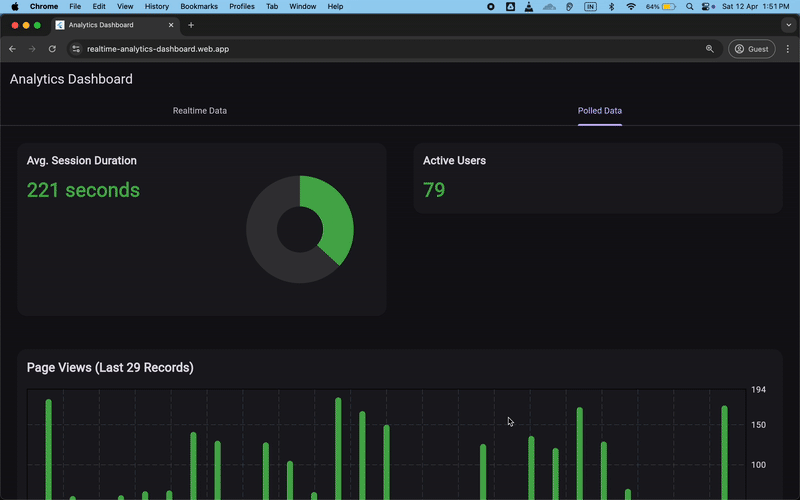
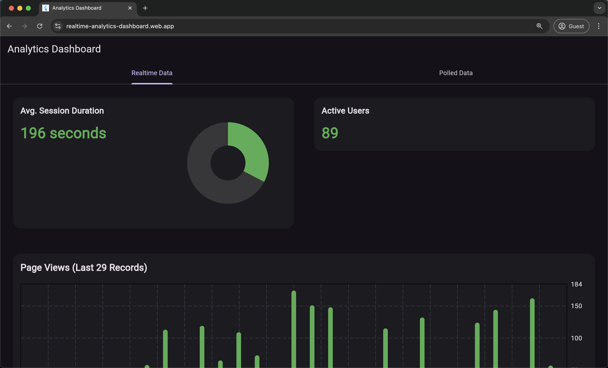
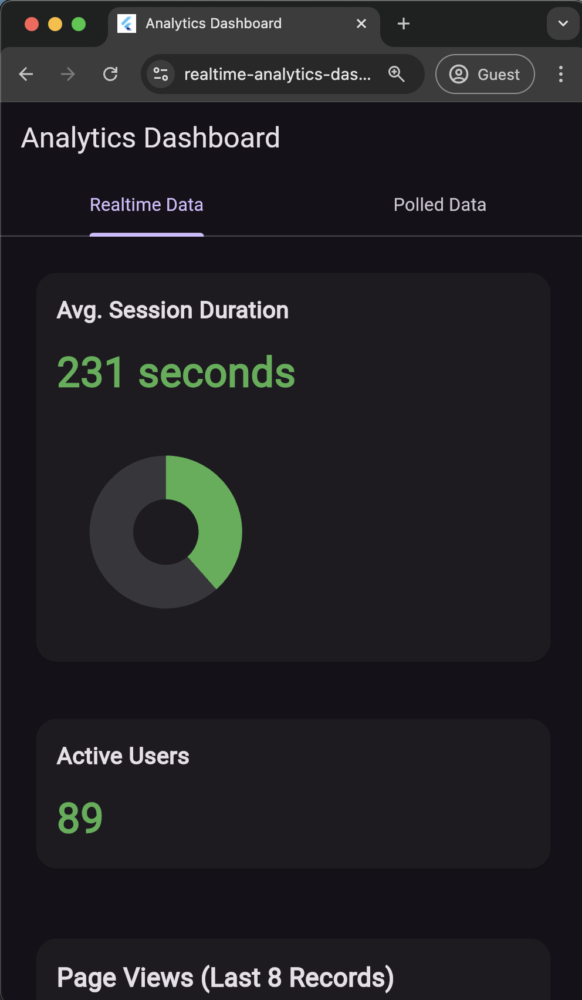
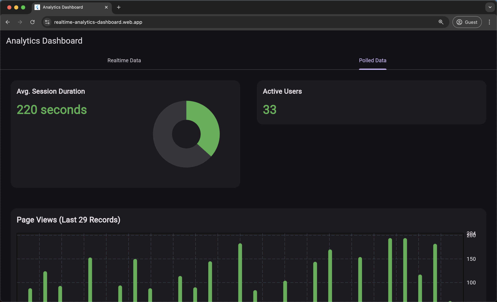
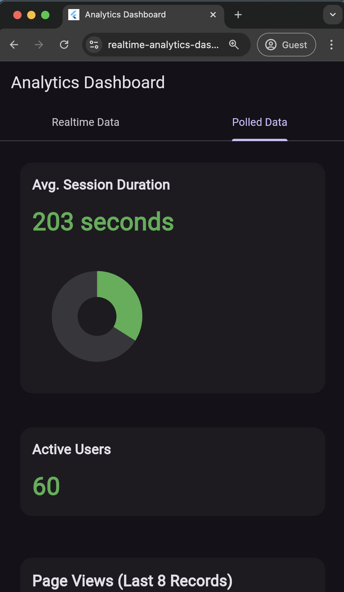
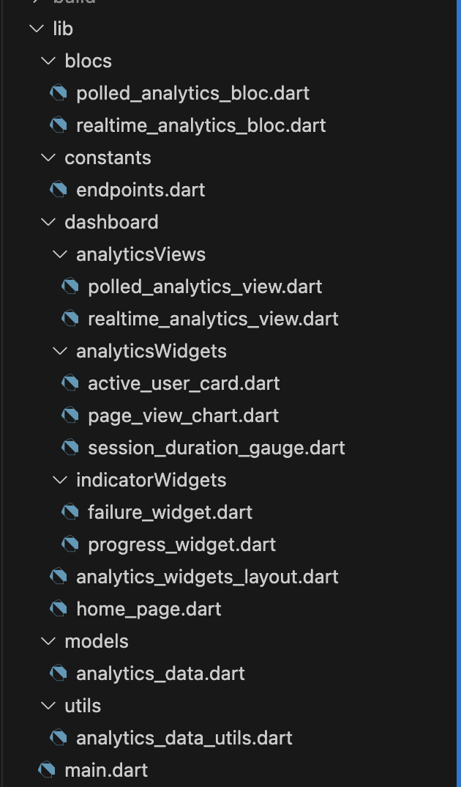

# Real-Time Analytics Dashboard

This is a web-based real-time analytics dashboard built with Flutter. It visualizes live traffic metrics like page views, active users, and average session duration. The app supports both WebSocket and HTTP polling modes. It follows a modular and clean architecture using BLoC for state management.

Live URL: [https://realtime-analytics-dashboard.web.app](https://realtime-analytics-dashboard.web.app)

---

## Screenshots and GIF

### Web Version Walkthrough


### WebSocket Mode


### Polling Mode




---

## Features

- Real-time and polling-based data fetching
- Responsive layout for mobile and web
- Modular widget structure with reusable components
- Custom BLoC implementation for both modes
- Dynamic charts using `fl_chart`
- Hosted using Firebase Hosting

---

## Tech Stack

| Layer     | Tools/Frameworks Used                           |
|-----------|-------------------------------------------------|
| Frontend  | Flutter `3.27.3`, flutter_bloc, fl_chart        |
| Backend   | Instructions available [HERE](https://github.com/vinaysmh/realtime_analytics_backend)|
| Hosting   | Firebase Hosting                                |
| Charts    | fl_chart (bar, pie)                             |
| State Mgmt| BLoC (for both polling and WebSocket data flow) |

---

## Data Flow

1. The backend generates mock analytics data at regular intervals.
2. Data is broadcast through WebSocket and exposed via a polling endpoint (`/api/analytics`).
3. The frontend connects via WebSocket and HTTP polling for data from mock backend.
4. The BLoC layer updates the UI based on the incoming stream or polled response.

---

## Real-Time Logic

### WebSocket Mode

- WebSocket server (/ws) sends JSON data every 1.5 seconds.
- A WebSocket client connects on app startup .
- BLoC listens to socket stream and updates the state.
- Charts and metrics rebuild based on the new data.

### Polling Mode

- HTTP requests triggered every 3 seconds.
- The response is parsed and passed into the BLoC.
- Screen-level logic ensures updates are isolated to relevant views.


---

## Running the App Locally

### 1. Clone the repository

```bash
git clone https://github.com/vinaysmh/realtime_analytics_frontend.git
cd realtime_analytics_frontend
```

### 2. Run the Flutter app

```bash
flutter pub get
flutter run -d chrome
```
---

## Running the Hosted Version

The app is hosted using Firebase Hosting. A live instance is deployed here:

[https://realtime-analytics-dashboard.web.app](https://realtime-analytics-dashboard.web.app)

To deploy your own version:

```bash
flutter build web
firebase login
firebase init hosting
firebase deploy
```

---

## HTML Loader Customization

To maintain visual consistency during Flutter’s initial load, minor edits were made to `web/index.html`.

```html
<!DOCTYPE html>
<html>

<head>

  <base href="$FLUTTER_BASE_HREF">

  <meta charset="UTF-8">
  <meta content="IE=Edge" http-equiv="X-UA-Compatible">
  <meta name="description" content="A new Flutter project.">

  <!-- iOS meta tags & icons -->
  <meta name="mobile-web-app-capable" content="yes">
  <meta name="apple-mobile-web-app-status-bar-style" content="black">
  <meta name="apple-mobile-web-app-title" content="dashboard">
  <link rel="apple-touch-icon" href="icons/Icon-192.png">

  <!-- Favicon -->
  <link rel="icon" type="image/png" href="favicon.png" />

  <title>Real-Time Analytics Dashboard</title>
  <link rel="manifest" href="manifest.json">

  <style>
    body {
      margin: 0;
      height: 100vh;
      display: flex;
      justify-content: center;
      align-items: center;
      background-color: #121212; /* match Flutter dark mode */
      color: white;
    }
  </style>
</head>

<body>
  <p>
    Initializing the dashboard...
  </p>
  <script src="flutter_bootstrap.js" async></script>
</body>

</html>
```

This ensures that the UI matches the dashboard theme while Flutter initializes.

---

## Folder Structure

```
lib/
├── blocs/                   # Realtime and polled analytics BLoCs
├── constants/               # Endpoints and constants
├── dashboard/
│   ├── analyticsViews/      # Real-time and polled views
│   ├── analyticsWidgets/    # Charts and cards (page views, users, session)
│   ├── indicatorWidgets/    # Reusable loading and failure widgets
├── models/                  # AnalyticsData model
├── utils/                   # AnalyticsData utility extensions
├── main.dart                # App entry point
└── home_page.dart           # Top-level layout and view selector
```
### Complete Folder Structure

---

## Utility Logic

`analytics_data_utils.dart` contains non-static utility methods for `List<AnalyticsData>` to compute:

- Average session duration
- Progress indicators
- Latest values for display

This allows clean separation between models and logic used across views and BLoC layers.

---

## Notes

- You can change tabs to switch between WebSocket and HTTP polling.
- Chart rendering adapts to screen size with padding logic in case of less data points.
- LayoutBuilder helps control bar count based on width to prevent index overflows.
- The backend uses generated mock data for visualization purposes.